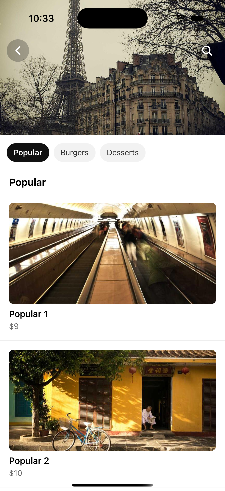
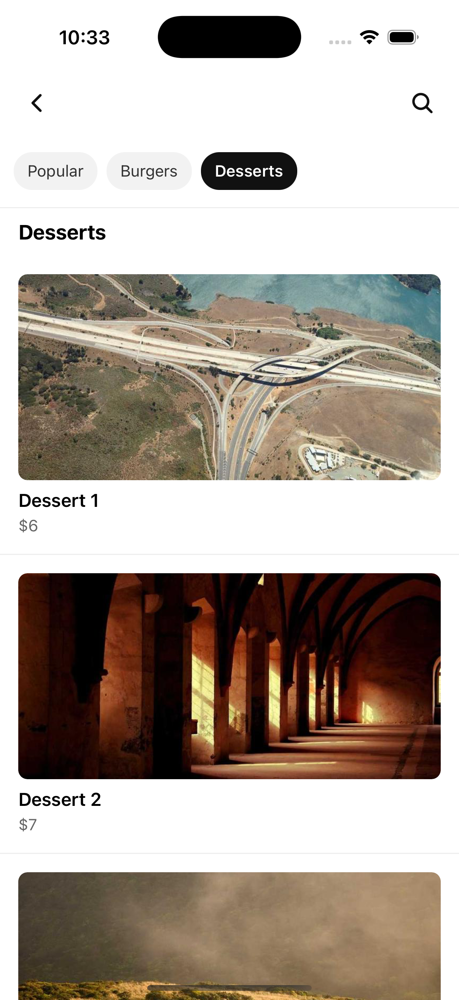

# Sticky Tabs — React Native (Expo)

A smooth, UI-thread–driven sticky tabs interaction built with **Expo**, **React Native**, and **Reanimated**.

<p align="center">
  <!-- Put your screenshots in /md. If filenames contain spaces, this HTML tag will still work. -->
  
  
</p>

> If your images are named like **Simulator Screenshot - iPhone 16 ….png**, either rename them to `screenshot-1.png` / `screenshot-2.png` or URL-encode spaces (e.g., `Simulator%20Screenshot%20-%20iPhone%2016%20....png`).

---

## Quick Start

### Requirements
- Node.js **≥ 18**
- npm / yarn / pnpm
- Android Studio (AVD) or Xcode (iOS Simulator) for emulators
- Optional: Expo Go app for on-device testing

### Install & Run

```bash
# 1) Clone
git clone https://github.com/Md-Yousuf-sheikh/react-native-stikcky-tab
cd react-native-stikcky-tab

# 2) Install dependencies
npm install
# or: yarn install / pnpm install

# 3) Start the app (pick one)
npm run ios       # iOS Simulator (macOS + Xcode)
npm run android   # Android emulator or device
npm run web       # Experimental web target
# or open Dev Tools:
npm run start
